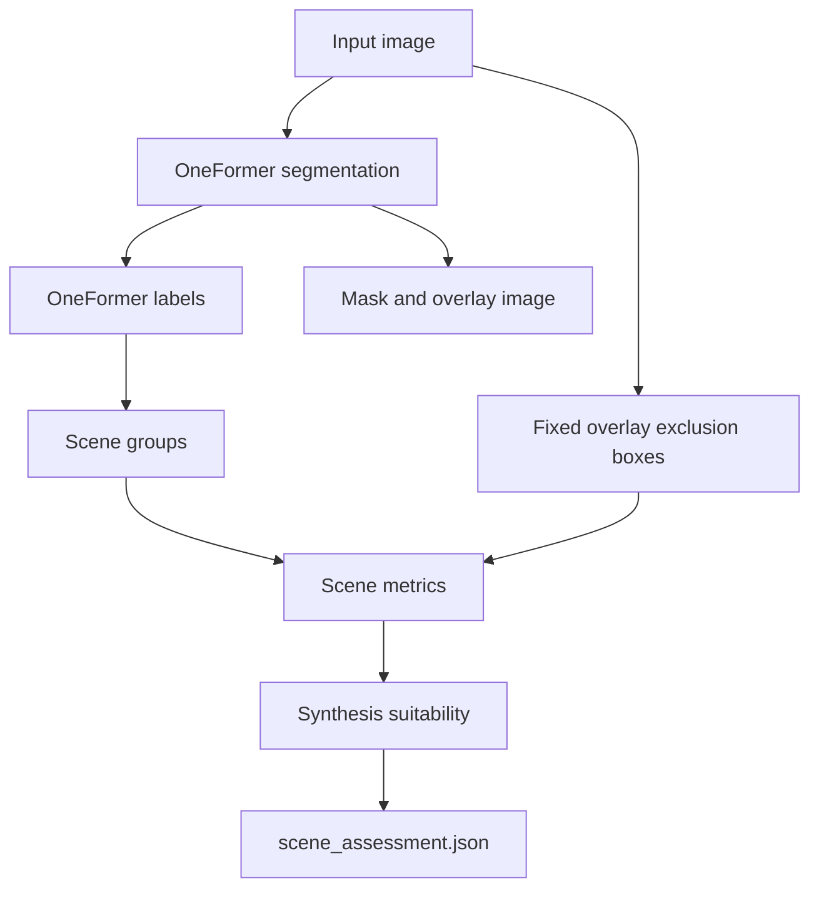

# Scene Understanding Rules

This package gives each camera image a rough scene summary. The goal is not to perfectly understand the dike. The goal is simpler: summarize useful visible surfaces and decide which defect types are reasonable targets for synthesis.

The rules in this README are the source of truth for the intended behavior. If the code disagrees with this document, the code should be refactored to match the README.

These rules are heuristic. They are meant for early triage and eye testing. They are not calibrated scientific thresholds yet.

## Current Flow



The command-line tool writes two JSON files:

| File | Meaning |
|---|---|
| `oneformer_outputs.json` | Maps each original image path to the generated mask and overlay image paths. |
| `scene_assessment.json` | Stores top labels, metrics, and synthesis suitability. |

The mask and all metrics are computed on the processed image size. By default, the CLI resizes the image so the largest side is at most `1024` pixels. Use the same `--max-side` value when comparing results across runs.

## OneFormer Labels

OneFormer predicts labels such as `water`, `sea`, `grass`, `road, route`, `building`, and `sky`. The scene-understanding code should map useful labels into simpler scene groups.

We do not need to use every observed OneFormer label. Some labels are too small, too ambiguous, or not useful for defect synthesis. The important rule is: every label that clearly helps identify a useful target surface or important context should be mapped below.

For this camera network, some OneFormer labels should be interpreted by context rather than by their literal name. For example, `grandstand, covered stand` is not expected to mean a real grandstand here. Based on visual checks, it usually means a dam wall, revetment, or stepped hard structure, so it should count as useful hard/structure surface.

Colors in the overlay are only for human inspection. They do not affect any metric or decision.

## Scene Groups

The intended mapping uses these scene groups:

| Scene group | Meaning | OneFormer labels to include |
|---|---|---|
| `water` | Water-like area. | `sea`, `water`, `river` |
| `soft_land` | Soil, grass, sand, field, or similar land-like surface. | `grass`, `earth, ground`, `sand`, `field`, `dirt track` |
| `hard_surface` | Road, path, wall, stone, revetment, steps, pier, bridge, or similar hard surface. | `road, route`, `path`, `wall`, `rock, stone`, `bridge, span`, `grandstand, covered stand`, `pier`, `stairway, staircase` |
| `road_path` | Road-like or path-like surface. | `dirt track`, `road, route`, `path` |
| `structure` | Built structure or man-made boundary. | `wall`, `building`, `house`, `bridge, span`, `fence`, `bannister, banister, balustrade, balusters, handrail`, `grandstand, covered stand`, `pier`, `stairway, staircase` |
| `vegetation_occluder` | Tree or plant areas that may block the view. | `tree`, `plant`, `palm, palm tree` |
| `dynamic_occluder` | Moving objects or people. | `person`, `car`, `truck`, `bus`, `minibike, motorbike`, `bicycle`, `boat` |
| `sky` | Sky. | `sky` |
| `overlay` | Approximate text overlay area from the camera image. | Created from fixed boxes, not from OneFormer. |
| `exclude` | Areas the later rules should ignore. | `sky` OR `vegetation_occluder` OR `dynamic_occluder` OR `overlay` |
| `usable_surface` | Area that may be useful for inspection or synthesis. | (`soft_land` OR `hard_surface`) AND NOT `water` AND NOT `exclude` |

Some labels belong to more than one group:

| Label | Groups |
|---|---|
| `dirt track` | `soft_land`, `road_path` |
| `road, route` | `hard_surface`, `road_path` |
| `path` | `hard_surface`, `road_path` |
| `wall` | `hard_surface`, `structure` |
| `bridge, span` | `hard_surface`, `structure` |
| `grandstand, covered stand` | `hard_surface`, `structure` |
| `pier` | `hard_surface`, `structure` |
| `stairway, staircase` | `hard_surface`, `structure` |

Some observed labels are intentionally not target surfaces. For example, `pole`, `street lamp`, `tower`, `traffic light`, `signboard, sign`, and `bench` may appear in camera images, but they are small scene objects rather than useful places to synthesize dike defects. They can remain neutral unless later review shows they are causing problems.

## Text Overlay Exclusion

The camera images often contain a timestamp near the top-right and a site name near the bottom-left. The code does not read this text. Instead, it excludes two fixed rectangles based on image size.

| Region | Current rule |
|---|---|
| Timestamp box | Top-right area where `x >= 62%` of image width and `y < 14%` of image height. |
| Site-name box | Bottom-left area where `x < 58%` of image width and `y >= 86%` of image height. |

These boxes are approximate. They are designed to avoid counting text as useful surface and to avoid placing synthetic defects over text.

## Metrics

Most metrics are simple area ratios. A ratio of `0.25` means 25% of the processed image.

| Metric | Meaning |
|---|---|
| `water_area_ratio` | Fraction of the image marked as `water`. |
| `soft_land_area_ratio` | Fraction marked as `soft_land`. |
| `hard_surface_area_ratio` | Fraction marked as `hard_surface`. |
| `road_path_area_ratio` | Fraction marked as `road_path`. |
| `structure_area_ratio` | Fraction marked as `structure`. |
| `vegetation_occluder_area_ratio` | Fraction marked as `vegetation_occluder`. |
| `dynamic_occluder_area_ratio` | Fraction marked as `dynamic_occluder`. |
| `sky_area_ratio` | Fraction marked as `sky`. |
| `overlay_excluded_ratio` | Fraction covered by the fixed overlay exclusion boxes. |
| `usable_surface_area_ratio` | Fraction marked as usable surface. |
| `usable_surface_largest_component_ratio` | Largest connected usable surface region, divided by the full image area. |
| `soft_land_largest_component_ratio` | Largest connected soft-land region, after excluding `exclude`. |
| `road_path_largest_component_ratio` | Largest connected road/path region, after excluding `exclude`. |
| `structure_largest_component_ratio` | Largest connected structure region, after excluding `exclude`. |
| `water_land_boundary_length_px` | Number of usable land pixels that touch water after expanding the water mask by one pixel. |
| `water_land_boundary_ratio` | `water_land_boundary_length_px` divided by the larger image side. |

Connected regions use 8-direction connectivity. In plain terms, pixels can connect through sides or corners.

The water-land boundary uses a stricter one-pixel expansion in four directions: up, down, left, and right. This gives a simple estimate of how much useful land sits directly next to water.

## Synthesis Suitability

Synthesis suitability asks a more specific question: which defect type can be reasonably added to this image?

The status values are:

| Status | Meaning |
|---|---|
| `ok` | The image has enough of the required visible surface for this synthesis type. |
| `maybe` | The image has some useful evidence, but the target area may be small, fragmented, or uncertain. |
| `poor` | The image is probably not a good target for this synthesis type. |

The score is a rough ranking value between `0` and `1`. The status is still controlled by the hard threshold rules below.

### Erosion

Erosion synthesis needs visible water and useful land next to water.

Numbers used:

| Number | Used as | Plain meaning | Why this starting value was chosen |
|---:|---|---|---|
| `0.03` | Minimum water area for `ok` | At least 3% of the image should be water. | Erosion near a river or canal needs visible water context. This value accepts water that is clearly present but does not require the image to be water-dominated. |
| `0.10` | Minimum water-land boundary for `ok` | The water-land contact length should be at least 10% of the larger image side. | Erosion needs a visible bank or shoreline. This checks for enough contact between water and usable land. |
| `0.015` | Minimum water area for `maybe` | At least 1.5% of the image should be water. | This keeps images where water is visible but small. |
| `0.04` | Minimum water-land boundary for `maybe` | The water-land contact length should be at least 4% of the larger image side. | This keeps images with a short but possible waterline. |
| `0.45` | Weight for water area in the score | Water area contributes 45% of the score. | Water must be visible, but area alone is not enough for erosion placement. |
| `0.55` | Weight for water-land boundary in the score | Boundary length contributes 55% of the score. | A visible water-land edge is the more direct sign that erosion synthesis has a plausible place to occur. |

Score:

```text
water_score = water_area_ratio / 0.03, clamped to [0, 1]
boundary_score = water_land_boundary_ratio / 0.10, clamped to [0, 1]
score = 0.45 * water_score + 0.55 * boundary_score
```

Status:

| Status | Current rule | Reasons |
|---|---|---|
| `ok` | `water_area_ratio >= 0.03` AND `water_land_boundary_ratio >= 0.10` | `water_present`, `land_water_boundary_sufficient` |
| `maybe` | `water_area_ratio >= 0.015` OR `water_land_boundary_ratio >= 0.04` | `water_area_limited` and/or `land_water_boundary_limited` |
| `poor` | Otherwise | `no_clear_waterline` |

### Vegetation

Vegetation synthesis needs enough land-like surface.

Numbers used:

| Number | Used as | Plain meaning | Why this starting value was chosen |
|---:|---|---|---|
| `0.12` | Minimum soft-land area for `ok` | At least 12% of the image should be grass, soil, sand, field, or dirt track. | Vegetation needs enough land-like target area to look plausible. This is a modest area threshold for a first-pass triage. |
| `0.08` | Minimum largest soft-land region for `ok` | At least 8% of the image should be one connected soft-land region. | This avoids placing vegetation on tiny disconnected fragments or letting a large paved area make the vegetation score look better. |
| `0.05` | Minimum soft-land area for `maybe` | At least 5% of the image should be soft land. | This keeps images where a small land target may still be useful. |
| `0.55` | Weight for soft-land area in the score | Soft-land area contributes 55% of the score. | Vegetation mainly needs enough land-like area. |
| `0.45` | Weight for largest soft-land region in the score | Largest connected soft-land region contributes 45% of the score. | Connected area still matters, but it is slightly less important here because vegetation patches can be irregular. |

Score:

```text
area_score = soft_land_area_ratio / 0.12, clamped to [0, 1]
component_score = soft_land_largest_component_ratio / 0.08, clamped to [0, 1]
score = 0.55 * area_score + 0.45 * component_score
```

Status:

| Status | Current rule | Reason |
|---|---|---|
| `ok` | `soft_land_area_ratio >= 0.12` AND `soft_land_largest_component_ratio >= 0.08` | `land_surface_sufficient` |
| `maybe` | `soft_land_area_ratio >= 0.05` | `land_surface_limited` |
| `poor` | Otherwise | `land_surface_insufficient` |

### Seepage

Seepage or sand-boil synthesis needs soft land, such as grass, soil, field, or sand. The score is reduced if road/path takes up a large part of the image.

Numbers used:

| Number | Used as | Plain meaning | Why this starting value was chosen |
|---:|---|---|---|
| `0.12` | Minimum soft-land area for `ok` | At least 12% of the image should be soft land. | Seepage should appear on soil, grass, sand, or similar surface. This requires a visible target area without demanding that most of the image be land. |
| `0.08` | Minimum largest soft-land region for `ok` | At least 8% of the image should be one connected soft-land region. | Seepage needs a continuous area where a wet patch or boil could fit. |
| `0.05` | Minimum soft-land area for `maybe` | At least 5% of the image should be soft land. | This keeps small possible target areas for review. |
| `0.45` | Maximum road/path area allowed for `ok` | Road/path should not cover more than 45% of the image. | If road/path dominates the image, seepage on natural ground is less likely to be a good synthesis target. |
| `0.55` | Weight for soft-land area in the base score | Soft-land area contributes 55% before the road penalty. | Total soft-land area is the main evidence for seepage placement. |
| `0.45` | Weight for largest soft-land region in the base score | Largest soft-land region contributes 45% before the road penalty. | A connected target region is also important, but slightly less than total area. |
| `1.0` | No-penalty multiplier baseline | The score starts at full strength before road/path penalty is applied. | This makes the penalty easy to read: road/path can only reduce the base score, not increase it. |
| `0.35` | Maximum road/path penalty strength | Road/path can reduce the seepage score by up to 35%. | Road/path dominance should lower seepage suitability, but it should not erase all soft-land evidence by itself. |

Score:

```text
area_score = soft_land_area_ratio / 0.12, clamped to [0, 1]
component_score = soft_land_largest_component_ratio / 0.08, clamped to [0, 1]
road_penalty = road_path_area_ratio / 0.45, clamped to [0, 1]
score = (0.55 * area_score + 0.45 * component_score) * (1.0 - 0.35 * road_penalty)
score is clamped to [0, 1]
```

This means road/path can reduce the seepage score by up to 35%.

Status:

| Status | Current rule | Reason |
|---|---|---|
| `ok` | `soft_land_area_ratio >= 0.12` AND `soft_land_largest_component_ratio >= 0.08` AND `road_path_area_ratio <= 0.45` | `soft_land_surface_sufficient` |
| `maybe` | `soft_land_area_ratio >= 0.05` | `soft_land_surface_limited`; also `road_surface_dominant` if `road_path_area_ratio > 0.45` |
| `poor` | Otherwise | `soft_land_surface_insufficient` |

### Structure Damage

Structure-damage synthesis needs enough visible structure-like area.

Numbers used:

| Number | Used as | Plain meaning | Why this starting value was chosen |
|---:|---|---|---|
| `0.06` | Minimum structure area for `ok` | At least 6% of the image should be structure-like surface. | Structure damage needs a visible target such as wall, building, house, bridge, or fence. This accepts moderate structure presence. |
| `0.025` | Minimum structure area for `maybe` | At least 2.5% of the image should be structure-like surface. | This keeps small visible structures for review. |

Score:

```text
score = structure_area_ratio / 0.06, clamped to [0, 1]
```

Status:

| Status | Current rule | Reason |
|---|---|---|
| `ok` | `structure_area_ratio >= 0.06` | `structure_surface_sufficient` |
| `maybe` | `structure_area_ratio >= 0.025` | `structure_surface_limited` |
| `poor` | Otherwise | `structure_surface_insufficient` |

### Settlement

Settlement synthesis needs a large continuous road/path-like surface. This rule is intentionally simple and should be treated cautiously because settlement is a shape change, not just a texture patch.

Numbers used:

| Number | Used as | Plain meaning | Why this starting value was chosen |
|---:|---|---|---|
| `0.15` | Minimum road/path area for `ok` | At least 15% of the image should be road/path. | Settlement needs a clear road or crest-like surface. This asks for a visibly substantial road/path area. |
| `0.10` | Minimum largest road/path region for `ok` | At least 10% of the image should be one connected road/path region. | Settlement synthesis needs a continuous surface that can be warped or modified. |
| `0.05` | Minimum largest road/path region for `maybe` | At least 5% of the image should be one connected road/path region. | This keeps smaller road/path surfaces for review. |
| `0.45` | Weight for road/path area in the score | Road/path area contributes 45% of the score. | Total road/path area matters, but continuity matters slightly more. |
| `0.55` | Weight for largest road/path region in the score | Largest connected road/path region contributes 55% of the score. | A single continuous surface is more important for settlement than scattered road/path pixels. |

Score:

```text
area_score = road_path_area_ratio / 0.15, clamped to [0, 1]
component_score = road_path_largest_component_ratio / 0.10, clamped to [0, 1]
score = 0.45 * area_score + 0.55 * component_score
```

Status:

| Status | Current rule | Reason |
|---|---|---|
| `ok` | `road_path_area_ratio >= 0.15` AND `road_path_largest_component_ratio >= 0.10` | `continuous_road_path_surface_sufficient` |
| `maybe` | `road_path_largest_component_ratio >= 0.05` | `road_path_surface_limited` |
| `poor` | Otherwise | `road_path_surface_insufficient` |

## Important Limitations

These rules are deliberately simple.

They do not know whether a surface is truly part of a dike. They only use broad visual labels from OneFormer and simple area checks. For example, a road beside the dike and a road on top of the dike may both count as `road_path`.

They also do not use camera geometry, water level, distance to camera, or actual ground scale. Because of this, the results should be read as triage labels, not final ground truth.

The main expected use is:

1. Run the scene-understanding CLI.
2. Inspect the overlay images.
3. Inspect `scene_assessment.json`.
4. Adjust the group mappings and thresholds after enough examples have been checked.

## Future Calibration

The thresholds in this README are starter heuristics. A proper calibration step would need a hand-labeled review set where representative frames are assigned the desired `ok`, `maybe`, or `poor` status for each defect type.

After that review set exists, the thresholds can be swept and selected based on agreement with the labels. For example, balanced accuracy or Cohen's kappa can be used to measure how well the heuristic decisions match human review.

Until that review set exists, these thresholds should be treated as practical triage rules, not calibrated decision boundaries.
